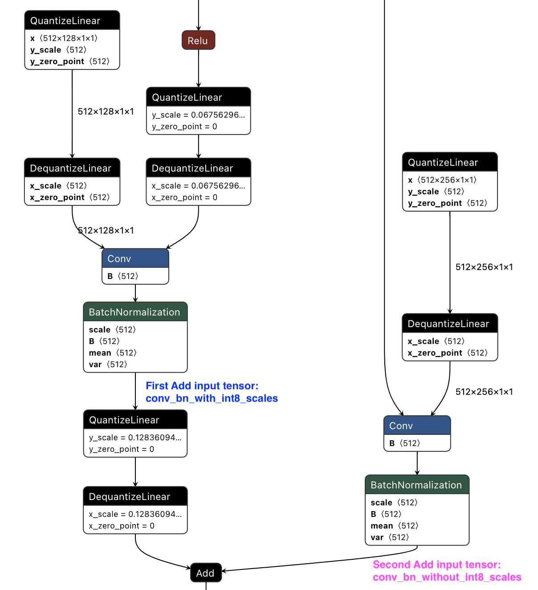
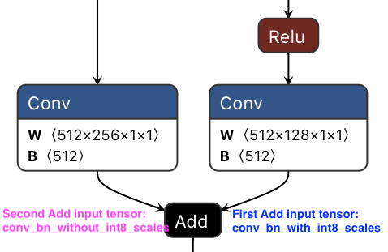

# QDQ Translator

Translate ONNX graph from QAT models - containing Quantize and DeQuantize nodes (Q/DQ) - to tensor scales and an ONNX model without Q/DQ nodes (stripped).

**IMPORTANT:** For usage with DLA, you need at least DLA SW 3.13.0. The following steps are not supported on Jetson yet and only apply to Orin DLA. Below the minimum system requirements for DLA.

| Hardware platform | OS | DLA SW version |
| -------- | -------- | -------- |
| DRIVE Orin (Automotive) | DRIVE OS 6.0.7.0 | DLA 3.13.0 |
| Jetson Orin (Embedded) | JetPack 6.0 (unreleased) | DLA 3.14.1 |

Process for a ResNet-50 example model in a nutshell:
```sh
MODEL="resnet_50v1"
python3 qdq_translator.py --input_onnx_models ${MODEL}.onnx --output_dir ./translated --add_unary_ew_scales_for_dla

trtexec --onnx=translated/${MODEL}_noqdq.onnx \
        --calib=translated/${MODEL}_precision_config_calib.cache \
        --useDLACore=0 \
        --int8 \
        --fp16 \
        --saveEngine=${MODEL}.engine \
        --precisionConstraints=prefer \
        --layerPrecisions=$(cat translated/${MODEL}_precision_config_layer_arg.txt) \
        [--allowGPUFallback OR --inputIOFormats=int8:hwc4 --outputIOFormats=fp16:chw16]
```

## Getting started

### Usage
```bash
python3 qdq_translator.py -h
usage: Translate an ONNX model with Q/DQ nodes into an ONNX model without Q/DQ nodes plus a JSON file with int8 tensor scales and tensors that need to run at higher precision. This script also generates a calibration cache file and the argument for --layerPrecisions to use with trtexec.
       [-h] --input_onnx_models INPUT_ONNX_MODELS [INPUT_ONNX_MODELS ...] [--output_dir OUTPUT_DIR]        [--trt_calib_version TRT_CALIB_VERSION] [--infer_average_pool_scales] [--infer_concat_scales]
       [--addtl_ops_to_infer_adjacent_scales ADDTL_OPS_TO_INFER_ADJACENT_SCALES [ADDTL_OPS_TO_INFER_ADJACENT_SCALES ...]] [--rename_node_outputs]
       [--add_unary_ew_scales_for_dla] [--verbose]

optional arguments:
  -h, --help            show this help message and exit
  --input_onnx_models INPUT_ONNX_MODELS [INPUT_ONNX_MODELS ...], -i INPUT_ONNX_MODELS [INPUT_ONNX_MODELS ...]
                        A space-separated list of input ONNX models with Q/DQ nodes.
  --output_dir OUTPUT_DIR, -o OUTPUT_DIR
                        The output directory where the ONNX file(s) without Q/DQ nodes and their respective precision configs are placed.
                        Additionally exports this info in a trtexec-friendly format. Default: "./translated"
  --trt_calib_version TRT_CALIB_VERSION
                        The TensorRT version used for exporting a trtexec-compatible calib cache. Default: "8600".
  --infer_average_pool_scales
                        If set, derive missing input or output scales of (Global)AveragePool and ReduceMean from upstream or downstream tensors
                        (assuming that they do not change). Can help with reducing latency but may also result in lower accuracy compared to running
                        more ops at higher precision.
  --infer_concat_scales
                        If set, derive missing input/output scales for Concat layer. Since concat is a multi-input layer, the output scale is set to the maximum existing input scale. This may help some models, such as
                        Inception-V3, maintain their accuracy.
  --infer_mul_scales
                        If set, derive missing scales for Mul operation. Can help with reducing latency but may also result in lower accuracy compared to running more ops at higher precision.
  --calibration_type
                        If the maximum (max) calibration method is employed, it is imperative to conduct a range check on the domain of values for the scale parameter.
                        In contrast, if the histogram calibration method is adopted, this particular examination can be deemed unnecessary and therefore skipped.
  --addtl_ops_to_infer_adjacent_scales ADDTL_OPS_TO_INFER_ADJACENT_SCALES [ADDTL_OPS_TO_INFER_ADJACENT_SCALES ...]
                        A space-separated list of ONNX operators whose scales can be propagated upstream and/or downstream, in addition to the
                        default ops used in this manner: {'Pad', 'Transpose', 'MaxPool', 'Flatten', 'Relu', 'Squeeze', 'Reshape', 'Sigmoid'}.
  --rename_node_outputs
                        Rename each tensor to its producer node's name.
  --add_unary_ew_scales_for_dla
                        For element-wise nodes consuming from Convs w/o Q/DQ nodes in between, insert unary scales.
  --verbose             Increase verbosity.
```

### Install requirements
```bash
python3 -m pip install -r ../../requirements.txt
```

### Workflow
**Assumptions**
* QAT model is available as `${MODEL}.onnx`. This model should contain Q/DQ nodes around relevant layers.
* The QAT model was trained using [NVIDIA PyTorch Quantization](https://github.com/NVIDIA/TensorRT/tree/main/tools/pytorch-quantization) or [NVIDIA TensorFlow Quantization](https://github.com/NVIDIA/TensorRT/tree/main/tools/tensorflow-quantization) with the following configs:
   * Activation quantization: `per_tensor` (`calib_method` can be `'max'` or `'histogram` for PyTorch)
   * Weight quantization: `per_channel` (`calib_method` must be `'max'` for PyTorch - if you still want to give it a try with `'histogram'`, you can add the `--calibration_type histogram` arg when running `qdq_translator.py`)

**Steps**
1. Inspect `${MODEL}.onnx` (with Q/DQ nodes) with [Netron](https://netron.app/).

2. Translate the model:
```bash
python3 qdq_translator.py --input_onnx_models ${MODEL}.onnx --output_dir ./translated --add_unary_ew_scales_for_dla
```
See [Why is `--add_unary_ew_scales_for_dla` needed?](###why-is-add_unary_ew_scales_for_dla-needed) for a detailed explanation on the trailing argument.

3. Inspect the resulting model `translated/model_noqdq.onnx` (without Q/DQ nodes) and the int8 scaling factors + tensors that need to be in fp16 in `translated/model_precision_config.json`. A calibration cache file and the argument for `--layerPrecisions`, for use with `trtexec`, are exported as `translated/model_precision_config_calib.cache` and `translated/model_precision_config_layer_arg.txt`, respectively.

4. Build engine:
```sh
MODEL="model"
trtexec --onnx=translated/${MODEL}_noqdq.onnx \
        --calib=translated/${MODEL}_precision_config_calib.cache \
        --useDLACore=0 \
        --int8 \
        --fp16 \
        --saveEngine=${MODEL}.engine \
        --precisionConstraints=prefer \
        --layerPrecisions=$(cat translated/${MODEL}_precision_config_layer_arg.txt) \
        [--allowGPUFallback OR --inputIOFormats=int8:hwc4 --outputIOFormats=fp16:chw16]
```
`${MODEL}_noqdq_precision_config_layer_arg.txt` is generated in the previous step, and it's in the format `layer_name_1:fp16,layer_name_2:fp16,...`.

The flags `--precisionConstraints=obey` and `--layerPrecisions` are necessary here to ensure that INT8 layers run in that expected precision.
The need to ensure that arises from the fact that PTQ chooses the fastest kernels, which may at times be FP16 instead of INT8, which could 
result in a higher-than-expected accuracy.

### Why is `--add_unary_ew_scales_for_dla` needed?

Starting from DLA 3.13.0 (part of DRIVE OS 6.0.7.0), the DLA Compiler can recover missing scales between a `Conv` node whose outputs are fed into elementwise `Add` nodes and run both of them in INT8. TensorRT however may be overly careful and upgrade both nodes to FP16 on DLA in such cases, which is both undesirable from a perf but also from an accuracy point of view (since the missing truncation and quantization in INT8 may alter the outputs of the Q/DQ graph).

As an alias to missing scales, you can set unary scales between `Conv` and the element-wise node in TensorRT, which then propagates those scales to the DLA Compiler. Assuming the other inputs to `Add` have valid scales, the DLA Compiler will interpret unary scales of `1.0` in the same way as missing scales, and always fuse the `Conv` + `Add` nodes in the same way as expected in the Q/DQ graph. In the fused `Conv` + `Add` case, a unary scaling factor implies that the `Conv`'s accumulated outputs are only scaled according to the weight scales, and to those we add the dequantized inputs coming from the other `Conv` - exactly what we want here to mimic the original Q/DQ graph behavior.

Example:
The `Conv` + `BatchNormalization` + `Add` sequence producing tensor `"conv_bn_with_int8_scales"` on the right-hand side below does not have any nested Q/DQ nodes, whereas the left `Add` input `"conv_bn_without_int8_scales"` comes from a Q/DQ node output:



If we run `python3 qdq_translator.py --input_onnx_models ${MODEL}.onnx --output_dir ./translated`, the graph above will result in below graph without `QuantizeLinear`, `DequantizeLinear` and `BatchNormalization` nodes (note that the graph visualization now shows left and right `Add` inputs in reverse order):



When inspecting `translated/${MODEL}_precision_config.json` we can see the scaling factor of the `Add` input coming from the Q/DQ pair:
```
        "conv_bn_with_int8_scales": 0.12836094200611115,
```
while `conv_bn_without_int8_scales` would have no associated INT8 scales and TensorRT would run both the upstream `Conv` and the `Add` node in FP16.

If we now add `--add_unary_ew_scales_for_dla` to the the `qdq_translator.py` command, the following entry gets added to `translated/${MODEL}_precision_config.json`:

```
        "conv_bn_without_int8_scales": 1.0,
```
This will allow to run all nodes above in INT8 on DLA through TensorRT.


### Workflow: End-to-End Example
See [e2e_workflow](e2e_workflow) for a sample end-to-end workflow using [NVIDIA TensorFlow Quantization](https://github.com/NVIDIA/TensorRT/tree/main/tools/tensorflow-quantization).

## Disclaimers
* `opt_passes` and `ops_to_infer_adjacent_scales` in [qdq_translator.py](qdq_translator.py) may need to be expanded depending on the model.
  * For all available optimization passes, please refer to https://github.com/onnx/optimizer/tree/master/onnxoptimizer/passes
  * The list `ops_to_infer_adjacent_scales` indicates which ops need to have adjacent scales propagated to them.
    This allows those ops to run in the appropriate precision for optimal kernel fusions in TensorRT but may result in accuracy drop if used incorrectly.
    To extend it, please use the `--addtl_ops_to_infer_adjacent_scales` flag.


## ImageNet Top-1 accuracies with TensorRT 8.6-EA (on NVIDIA GeForce RTX™ 3090)
| Model                                  | Original Model<br>*(Explicit Quantization, with Q/DQ nodes)* | Model converted by QDQ Translator<br>*(Implicit Quantization with calibration table, without Q/DQ nodes)* |
|----------------------------------------|---------------------------------|----------------------------------|
| [ResNet-50v1](./e2e_workflow/) | 75.18%                           | 75.22%                            |
| ResNet-50v2                            | 75.77%                           | 73.87%                            |
| MobileNet-v1                           | 70.45%                           | 70.41%                            |
| MobileNet-v2                           | 71.62%                           | 71.73%                            |
| EfficientNet-B0                        | 75.83%                           | 75.79%                            |
| EfficientNet-B3                        | 79.02%                           | 77.96%                            |
| Inception-V3                           | 78.06%                           | 78.20% (with `--infer_concat_scales`)                            |

Just like [ResNet-50v1](./e2e_workflow/), all models trained with [NVIDIA TensorFlow Quantization](https://github.com/NVIDIA/TensorRT/tree/main/tools/tensorflow-quantization), see [tensorflow-quantization/examples](https://github.com/NVIDIA/TensorRT/tree/main/tools/tensorflow-quantization/examples). Evaluated on x86 training host. Results on Orin's DLA and GPU expected to be similar.

## Known issues
* There is no guarantee this script will work for all ONNX models with Q/DQ nodes. Community contributions are highly appreciated!
* `onnxoptimizer` is required to be exactly at version `0.3.2`. If newer versions are used, building a TensorRT engine may fail for models like EfficientNet-B0 or EfficientNet-B3 trained with [NVIDIA TensorFlow Quantization](https://github.com/NVIDIA/TensorRT/tree/main/tools/tensorflow-quantization).
